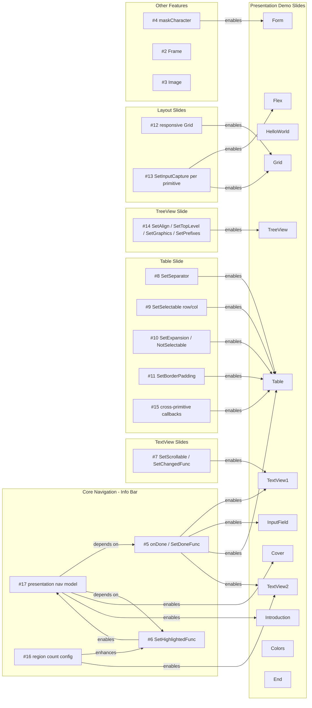

# Issue Dependencies and Presentation Demo

```mermaid
flowchart LR
    subgraph demo [Presentation Demo Slides]
        cover[Cover]
        intro[Introduction]
        helloworld[HelloWorld]
        inputfield[InputField]
        form[Form]
        textview1[TextView1]
        textview2[TextView2]
        table[Table]
        treeview[TreeView]
        flex[Flex]
        grid[Grid]
        colors[Colors]
        endSlide[End]
    end

    subgraph core [Core Navigation - Info Bar]
        i17["#17 presentation nav model"]
        i5["#5 onDone / SetDoneFunc"]
        i6["#6 SetHighlightedFunc"]
        i16["#16 region count config"]
    end

    subgraph textview [TextView Slides]
        i7["#7 SetScrollable / SetChangedFunc"]
    end

    subgraph tableIssues [Table Slide]
        i8["#8 SetSeparator"]
        i9["#9 SetSelectable row/col"]
        i10["#10 SetExpansion / NotSelectable"]
        i11["#11 SetBorderPadding"]
        i15["#15 cross-primitive callbacks"]
    end

    subgraph tree [TreeView Slide]
        i14["#14 SetAlign / SetTopLevel / SetGraphics / SetPrefixes"]
    end

    subgraph layout [Layout Slides]
        i12["#12 responsive Grid"]
        i13["#13 SetInputCapture per primitive"]
    end

    subgraph other [Other Features]
        i4["#4 maskCharacter"]
        i2["#2 Frame"]
        i3["#3 Image"]
    end

    i17 -->|depends on| i5
    i17 -->|depends on| i6
    i16 -->|enhances| i6

    i5 -->|enables| textview1
    i5 -->|enables| inputfield
    i5 -->|enables| table
    i5 -->|enables| textview2
    i6 -->|enables| i17
    i17 -->|enables| cover
    i17 -->|enables| intro
    i16 -->|enables| textview2

    i7 -->|enables| textview1
    i8 -->|enables| table
    i9 -->|enables| table
    i10 -->|enables| table
    i11 -->|enables| table
    i15 -->|enables| table

    i14 -->|enables| treeview
    i12 -->|enables| grid
    i13 -->|enables| flex
    i13 -->|enables| grid
    i4 -->|enables| form
```
